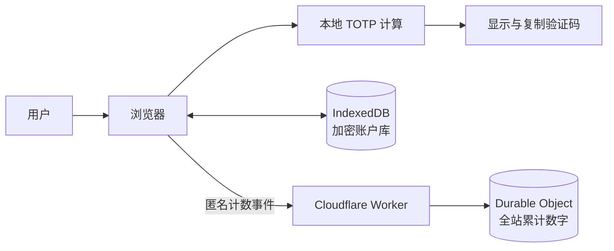

<div align="center">
  
  <h1>OmniTool</h1>
  <p><strong>隐私优先、浏览器原生的双重验证工具。</strong></p>
  <p>在本地生成 TOTP 验证码，加密保存账户，并可直接部署到 Cloudflare Workers。</p>
  <p>
    <a href="./README.md">简体中文</a>
    ·
    <a href="./README_EN.md">English</a>
  </p>
  <p>
    <a href="https://omnitool.aicnos.com">在线体验</a>
    ·
    <a href="#快速开始">快速开始</a>
    ·
    <a href="#部署到-cloudflare-workers">部署指南</a>
  </p>
</div>

---

OmniTool 是一个本地优先的浏览器工具箱，目前专注于双重验证（TOTP）。它不依赖前端框架或第三方运行时包，验证码计算和账户加密均在浏览器中完成，同时保留中英文、亮暗色、响应式布局和 Cloudflare 原生部署能力。

> [!IMPORTANT]
> OmniTool 适合作为便捷的个人 TOTP 工具，但不能替代硬件安全密钥、系统钥匙串或经过独立安全审计的密码管理器。

## 核心特性

| 能力 | 说明 |
| --- | --- |
| 本地生成 | TOTP 计算在浏览器中完成，支持 6/8 位验证码、自定义周期与 SHA-1、SHA-256、SHA-512 |
| 快速生成 | 粘贴 Base32 密钥或 `otpauth://` 链接即可临时生成，不创建账户 |
| 本机加密 | 已保存账户使用 Web Crypto AES-GCM 加密，并存入当前站点的 IndexedDB |
| 密钥链接 | 支持 `/2fa/<Base32密钥>` 自动填入和生成，并在读取后清理地址栏 |
| 现代界面 | 苹果风格的黑白视觉、亮暗色切换、中英文切换与完整响应式布局 |
| 动效与无障碍 | 包含开屏、进入、退出和切换动画，并遵循 `prefers-reduced-motion` |
| 匿名统计 | 页面内展示全站访问与使用次数，只提交聚合事件，不提交账户或验证码数据 |
| Cloudflare 原生 | 使用 Workers Static Assets、Worker API 与 SQLite Durable Object，无需独立服务器 |
| 零运行时依赖 | 前端和 Worker 均使用原生 Web API，生产包不加载第三方脚本、字体或分析 SDK |

## 在线使用

访问 **[omnitool.aicnos.com](https://omnitool.aicnos.com)**。

### 快速生成

1. 将 Base32 密钥或完整的 `otpauth://` 链接粘贴到“快速生成”输入框。
2. OmniTool 会立即生成当前验证码。
3. 该密钥不会保存为账户；刷新或清除后即从界面消失。

### 保存账户

1. 选择“添加账户”。
2. 输入 Base32 密钥，或粘贴包含服务名称和账户名的 `otpauth://` 链接。
3. 保存后，账户数据会加密存入当前浏览器的 IndexedDB。
4. 点击验证码即可复制；删除账户会同步删除本机存储中的对应数据。

### 通过链接填入密钥

```text
https://omnitool.aicnos.com/2fa/<Base32密钥>
```

有效链接会自动填入快速生成器、生成验证码，并立即将地址栏替换为 `/2fa`。

> [!WARNING]
> URL 路径会随首次 HTTP 请求发送给 Cloudflare，也可能进入浏览器历史、代理或基础设施日志。清理地址栏不能撤回首次请求。不要通过不可信渠道分享真实的 2FA 密钥链接；已暴露的真实密钥应在对应服务中重新生成。

## 隐私与安全模型

- 手动输入或保存在浏览器中的密钥不会通过统计接口提交。
- 账户库使用浏览器生成的不可导出 AES-GCM 密钥加密，并与密文一起保存在当前站点的 IndexedDB 中。
- 站点统计只记录 `访问` 与 `使用` 两类累计数字；应用不会将 IP、设备指纹、账户名、2FA 密钥或验证码写入统计存储。
- “使用次数”在快速生成成功或复制已保存账户的验证码时增加；每 30 秒的自动刷新不会增加计数。
- 全站累计数字保存在 Cloudflare SQLite Durable Object 中，与本机账户库分离。
- Worker 设置 CSP、HSTS、`Referrer-Policy: no-referrer`、`X-Content-Type-Options`、`X-Frame-Options` 等安全响应头。
- 项目不加载第三方前端脚本、远程字体或第三方分析 SDK。



浏览器本地加密可以降低静态存储被直接读取的风险，但无法防止能够控制当前浏览器会话、站点脚本或部署账户的攻击者。请同时保护 GitHub、Cloudflare 和日常使用设备，并为这些账户启用强密码和独立的 2FA。

## 技术实现

- 原生 HTML、CSS 与 JavaScript ES Modules
- Web Crypto API：HMAC 与 AES-GCM
- IndexedDB：本机加密账户存储
- Cloudflare Workers Static Assets：静态站点托管
- Cloudflare Durable Objects（SQLite）：原子化全站计数
- Node.js 内置测试运行器：RFC 与 Worker 行为测试

TOTP 实现包含 RFC 4226 HOTP 与 RFC 6238 TOTP 标准向量测试。

## 快速开始

### 环境要求

- Node.js 20 或更高版本
- 现代浏览器，需支持 Web Crypto、IndexedDB 和 JavaScript Modules

### 获取并验证项目

```bash
git clone https://github.com/mibgb65-cloud/OmniTool.git
cd OmniTool
npm run check
```

项目没有 npm 运行时依赖，因此无需安装生产包。`npm run check` 会依次运行测试并生成 `dist/`。

### 本地构建

```bash
npm run build
```

构建结果位于 `dist/`。可以使用任意静态文件服务器预览根页面：

```bash
python -m http.server 4173 --directory dist
```

如果需要测试 `/2fa/<密钥>` 等 SPA 路径，请先构建，再使用 Wrangler：

```bash
npm run build
npx wrangler dev
```

### 可用命令

| 命令 | 用途 |
| --- | --- |
| `npm run build` | 将允许发布的静态文件构建到 `dist/` |
| `npm test` | 运行 TOTP 与 Worker 单元测试 |
| `npm run check` | 先运行全部测试，再执行生产构建 |
| `npx wrangler dev` | 本地运行 Static Assets、Worker API 与 Durable Object |
| `npx wrangler deploy` | 部署到 Cloudflare Workers |

## 部署到 Cloudflare Workers

本项目已包含 [`wrangler.jsonc`](./wrangler.jsonc)，推荐直接连接 GitHub 仓库：

1. 登录 Cloudflare Dashboard，进入 **Workers & Pages**。
2. 选择 **Create application → Import a repository**。
3. 授权 GitHub 并选择 `mibgb65-cloud/OmniTool`。
4. 使用以下配置：

   | 设置 | 值 |
   | --- | --- |
   | Project name | `omni-tool` |
   | Production branch | `main` |
   | Build command | `npm run build` |
   | Deploy command | `npx wrangler deploy` |
   | Root directory | `/` |
   | API token | 由 Cloudflare 自动创建 |

5. 选择 **Deploy**。

首次部署会根据 Wrangler migration 自动创建 SQLite Durable Object 命名空间，不需要手动填写数据库 ID。此后推送到 `main` 会触发生产构建。

如需使用自定义域名，在 Worker 的 **Settings → Domains & Routes** 中添加域名，并确保域名所在 Zone 由同一 Cloudflare 账户管理。

相关文档：

- [Workers Builds configuration](https://developers.cloudflare.com/workers/ci-cd/builds/configuration/)
- [Workers Static Assets](https://developers.cloudflare.com/workers/static-assets/)
- [Durable Objects](https://developers.cloudflare.com/durable-objects/)

## 项目结构

```text
.
├── index.html
├── public/
│   └── favicon.svg
├── scripts/
│   └── build.mjs
├── src/
│   ├── app.js
│   ├── i18n.js
│   ├── styles.css
│   ├── totp.js
│   ├── vault.js
│   └── worker.js
├── tests/
│   ├── totp.test.mjs
│   └── worker.test.mjs
├── README.md
├── README_EN.md
├── package.json
└── wrangler.jsonc
```

## 参与贡献

欢迎 Issue 和 Pull Request。为保持项目简单、私密且易于部署，请在提交前：

1. 从 `main` 创建独立分支。
2. 将改动限制在明确的问题或功能范围内。
3. 新增用户文案时同步更新 [`src/i18n.js`](./src/i18n.js) 中英文翻译。
4. 不要在测试、Issue、提交记录或截图中包含真实的 2FA 密钥。
5. 运行 `npm run check` 并确认全部测试通过。
6. 在 Pull Request 中说明行为变化、隐私影响和验证方式。

## 安全问题

请勿在公开 Issue 中提交真实密钥、验证码或账户信息。仓库暂未配置专用的私密漏洞报告渠道；在提供该渠道前，请只提交不包含敏感数据的最小复现。

## 许可证

本仓库尚未添加开源许可证。在许可证文件加入前，源代码默认保留全部权利，公开可见不等同于获得复制、修改或分发授权。项目所有者应在正式接受外部贡献前选择并添加合适的许可证。
