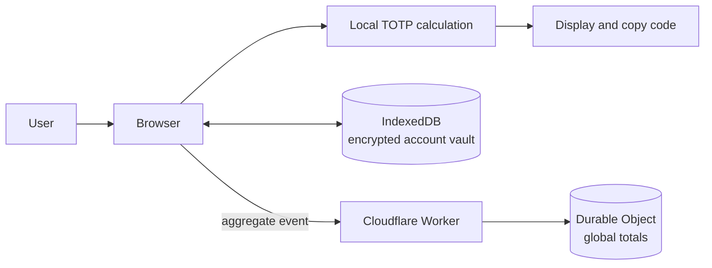

<div align="center">
  
  <h1>OmniTool</h1>
  <p><strong>A privacy-first, browser-native two-factor authentication tool.</strong></p>
  <p>Generate TOTP codes locally, store accounts securely, and deploy directly to Cloudflare Workers.</p>
  <p>
    <a href="./README.md">简体中文</a>
    ·
    <a href="./README_EN.md">English</a>
  </p>
  <p>
    <a href="https://omnitool.aicnos.com">Live Demo</a>
    ·
    <a href="#quick-start">Quick Start</a>
    ·
    <a href="#deploy-to-cloudflare-workers">Deployment</a>
  </p>
</div>

---

OmniTool is a local-first browser toolbox currently focused on two-factor authentication (TOTP). It uses no frontend framework or third-party runtime packages: code generation and account encryption happen in the browser, while the interface provides bilingual content, light and dark themes, responsive layouts, and a Cloudflare-native deployment path.

> [!IMPORTANT]
> OmniTool is designed as a convenient personal TOTP utility. It is not a replacement for hardware security keys, an operating-system keychain, or an independently audited password manager.

## Features

| Capability | Description |
| --- | --- |
| Local generation | Browser-side TOTP with 6/8 digits, custom periods, SHA-1, SHA-256, and SHA-512 |
| Quick generator | Paste a Base32 secret or `otpauth://` URI without creating an account |
| Encrypted vault | Saved accounts are encrypted with Web Crypto AES-GCM and stored in site-scoped IndexedDB |
| Secret links | `/2fa/<Base32-secret>` fills the quick generator, creates a code, and then cleans the address bar |
| Modern interface | Apple-inspired monochrome design, light/dark themes, Chinese/English, and responsive layouts |
| Motion and accessibility | Launch, enter, exit, and view transitions with `prefers-reduced-motion` support |
| Aggregate statistics | Displays global visit and usage totals without sending account or OTP data |
| Cloudflare-native | Workers Static Assets, a Worker API, and a SQLite Durable Object with no standalone server |
| Zero runtime dependencies | Native Web APIs only; no third-party scripts, fonts, or analytics SDKs in production |

## Live Demo

Visit **[omnitool.aicnos.com](https://omnitool.aicnos.com)**.

### Quick generation

1. Paste a Base32 secret or complete `otpauth://` URI into the quick generator.
2. OmniTool immediately generates the current code.
3. The secret is not saved as an account and disappears from the interface when cleared or reloaded.

### Saving an account

1. Select **Add account**.
2. Enter a Base32 secret, or paste an `otpauth://` URI containing the issuer and account label.
3. OmniTool encrypts and saves the account in the current browser's IndexedDB.
4. Select a code to copy it. Deleting an account removes its locally stored record.

### Filling a secret from a link

```text
https://omnitool.aicnos.com/2fa/<Base32-secret>
```

A valid link fills the quick generator, creates a code, and immediately replaces the visible URL with `/2fa`.

> [!WARNING]
> A URL path is sent to Cloudflare with the initial HTTP request and may appear in browser history, proxies, or infrastructure logs. Cleaning the address bar cannot undo that initial request. Never share real 2FA secret links through an untrusted channel; rotate any real secret that has been exposed.

## Privacy and security model

- Secrets entered manually or saved in the browser are never submitted through the statistics API.
- The account vault uses a non-extractable AES-GCM key generated by the browser and stores the key and ciphertext in site-scoped IndexedDB.
- Site statistics contain only aggregate `visit` and `use` values. The application does not write IP addresses, device fingerprints, account labels, 2FA secrets, or generated codes to the statistics store.
- A use is counted after a successful quick generation or when a saved account code is copied. Automatic 30-second refreshes are not counted.
- Aggregate values are stored in a Cloudflare SQLite Durable Object, separate from the local account vault.
- The Worker applies CSP, HSTS, `Referrer-Policy: no-referrer`, `X-Content-Type-Options`, `X-Frame-Options`, and related security headers.
- The frontend loads no third-party scripts, remote fonts, or external analytics SDKs.



Browser-side encryption reduces the risk of directly reading data at rest, but it cannot protect against an attacker who controls the current browser session, deployed site code, or deployment accounts. Secure the associated GitHub, Cloudflare, and device accounts with strong passwords and independent 2FA.

## Technology

- Native HTML, CSS, and JavaScript ES Modules
- Web Crypto API for HMAC and AES-GCM
- IndexedDB for the local encrypted account vault
- Cloudflare Workers Static Assets for hosting
- Cloudflare Durable Objects with SQLite for atomic global counters
- Node.js built-in test runner for standards and Worker behavior

The TOTP implementation is verified against RFC 4226 HOTP and RFC 6238 TOTP test vectors.

## Quick start

### Requirements

- Node.js 20 or later
- A modern browser with Web Crypto, IndexedDB, and JavaScript Modules

### Clone and verify

```bash
git clone https://github.com/mibgb65-cloud/OmniTool.git
cd OmniTool
npm run check
```

The project has no npm runtime dependencies, so no production package installation is required. `npm run check` runs the test suite and then creates `dist/`.

### Local build

```bash
npm run build
```

Build output is written to `dist/`. Any static server can preview the root page:

```bash
python -m http.server 4173 --directory dist
```

To test SPA paths such as `/2fa/<secret>`, build first and use Wrangler:

```bash
npm run build
npx wrangler dev
```

### Commands

| Command | Purpose |
| --- | --- |
| `npm run build` | Build the explicitly allowed static files into `dist/` |
| `npm test` | Run the TOTP and Worker unit tests |
| `npm run check` | Run every test, then produce a deployment build |
| `npx wrangler dev` | Run Static Assets, the Worker API, and Durable Object locally |
| `npx wrangler deploy` | Deploy the project to Cloudflare Workers |

## Deploy to Cloudflare Workers

The repository includes [`wrangler.jsonc`](./wrangler.jsonc). Connecting the GitHub repository is the recommended deployment method:

1. Open **Workers & Pages** in the Cloudflare Dashboard.
2. Select **Create application → Import a repository**.
3. Authorize GitHub and choose `mibgb65-cloud/OmniTool`.
4. Use the following settings:

   | Setting | Value |
   | --- | --- |
   | Project name | `omni-tool` |
   | Production branch | `main` |
   | Build command | `npm run build` |
   | Deploy command | `npx wrangler deploy` |
   | Root directory | `/` |
   | API token | Let Cloudflare create it |

5. Select **Deploy**.

On the first deployment, the Wrangler migration automatically creates the SQLite Durable Object namespace; no database ID is required. Later pushes to `main` trigger production builds.

To use a custom domain, add it under the Worker's **Settings → Domains & Routes** section. The domain's zone must be managed by the same Cloudflare account.

References:

- [Workers Builds configuration](https://developers.cloudflare.com/workers/ci-cd/builds/configuration/)
- [Workers Static Assets](https://developers.cloudflare.com/workers/static-assets/)
- [Durable Objects](https://developers.cloudflare.com/durable-objects/)

## Project structure

```text
.
├── index.html
├── public/
│   └── favicon.svg
├── scripts/
│   └── build.mjs
├── src/
│   ├── app.js
│   ├── i18n.js
│   ├── styles.css
│   ├── totp.js
│   ├── vault.js
│   └── worker.js
├── tests/
│   ├── totp.test.mjs
│   └── worker.test.mjs
├── README.md
├── README_EN.md
├── package.json
└── wrangler.jsonc
```

## Contributing

Issues and pull requests are welcome. To keep the project focused, private, and easy to deploy:

1. Create a focused branch from `main`.
2. Keep changes limited to one clearly described problem or feature.
3. Update both languages in [`src/i18n.js`](./src/i18n.js) whenever user-facing text changes.
4. Never include real 2FA secrets in tests, issues, commits, or screenshots.
5. Run `npm run check` and ensure every test passes.
6. Describe behavioral changes, privacy implications, and verification steps in the pull request.

## Security reports

Do not post real secrets, generated codes, or account information in public issues. This repository does not yet provide a private vulnerability-reporting channel; until one is available, share only minimal reproductions with all sensitive data removed.

## License

This project is licensed under the [MIT License](./LICENSE). See [`LICENSE`](./LICENSE) for the full terms.
